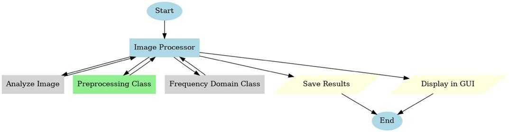
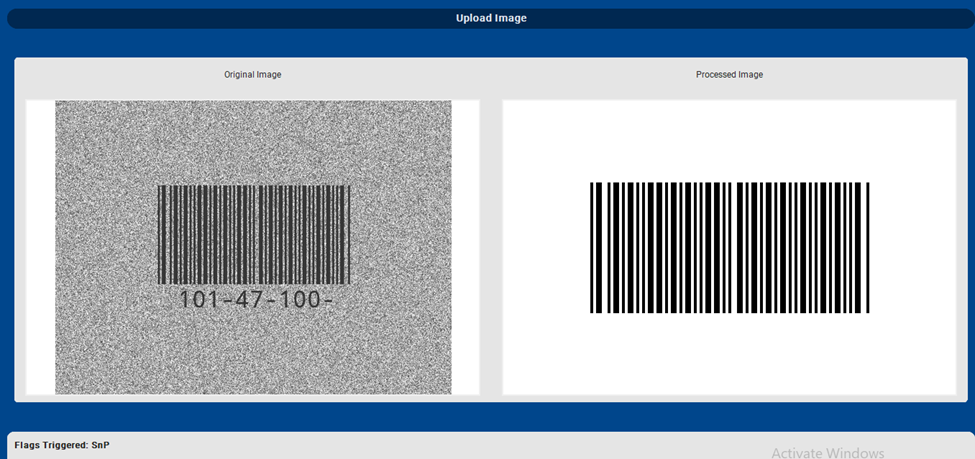

# Table of Contents(Phase 1)

- [Introduction](#introduction)
- [AnalyzeImage Class](#1-analyzeimage-class)
- [PreprocessImage Class](#2-preprocessimage-class)
- [ImageFrequencyTransformer Class](#3-imagefrequencytransformer-class)
- [ImageProcessor Class](#4-imageprocessor-class)
- [ImageProcessingGUI and TestBatchImageProcessor Classes](#5-imageprocessinggui-and-testbatchimageprocessor-classes)
- [Visual Representation of GUI with Barcode Processing](#6-visual-representation-of-gui-with-barcode-processing)
- [Conclusion](#conclusion)
- [References](#references)

# Introduction

For the development of our barcode processing system, an object-oriented programming approach is adopted for handling the complexity and modularity of the code. Our system will handle generic pre-processing of captured images and specifically focus on the distortions of several types of images containing barcodes.

**Detection and Analysis:** We utilize the AnalyzeImage class to detect and flag issues within the image. This class is equipped with methods to identify problems like blurriness, low or high contrast, presence of noise (salt and pepper noise), and to detect if there are obstructions or if the image is rotated.

**Preprocessing:** The PreprocessImage class is responsible for applying corrective measures based on the flags raised by AnalyzeImage. It includes methods for operations such as cropping, straightening, contrast enhancement, noise removal, and handling of lighting conditions, ensuring the image is as clear and usable as possible.

**Frequency Domain Corrections:** We've implemented the ImageFrequencyTransformer class to deal with issues in the frequency domain. This class helps in removing periodic noise and enhancing image details that might not be visible through simple spatial domain processing.

**Integration:** All these components are combined within the ImageProcessor class, which orchestrates the sequence of operations. This class manages the workflow by first analyzing the image for issues, then applying the necessary preprocessing steps from both PreprocessImage and ImageFrequencyTransformer to correct those issues.

We have also provided an implementation for TestBatchImageProcessor for testing purposes, allowing us to process several images in batch mode. This helps us in testing our system on a wide range of images for robustness and reliability. We have also created an ImageProcessingGUI using customtkinter for interactive and user-friendly operation. This provides a graphical interface where users can upload single images, see immediate processing results, and visualize the effects of our preprocessing techniques.

# 1 AnalyzeImage Class

The AnalyzeImage class serves as the diagnostic tool within our image processing system. Its primary function is to analyze an input image for various quality issues that might hinder further processing or interpretation. The workflow involves:

- **Initial Image Inspection:** Examining the image for basic attributes like brightness, contrast, and noise.
- **Detailed Analysis:** Using specific algorithms to check for blur, periodic noise, and structural issues like rotation or obstructions.
- **Flagging Issues:** Each method in the class returns a flag indicating whether a specific problem exists, which helps in deciding the next preprocessing steps.

# 3 ImageFrequencyTransformer Class

The ImageFrequencyTransformer class is dedicated to handling image corrections in the frequency domain. It utilizes the Fourier Transform to identify and mitigate noise or patterns that are not easily addressed in the spatial domain. The workflow includes:

- **Transform to Frequency Domain:** Converting the image into its frequency representation.
- **Noise Identification:** Analyzing the frequency spectrum to pinpoint noise or undesirable patterns.
- **Correction in Frequency Domain:** Applying masks or filters to remove or suppress these patterns.
- **Inverse Transform:** Converting back to the spatial domain after corrections.

# 4 ImageProcessor Class

The ImageProcessor class acts as the orchestrator for the entire image processing pipeline. It combines the functionalities of AnalyzeImage, PreprocessImage, and ImageFrequencyTransformer to process images systematically. The workflow encompasses:

- **Issue Detection:** Using AnalyzeImage to identify specific problems in the image
- **Preprocessing:** Applying corrective measures based on detected issues
- **Final Adjustments:** Ensuring images are correctly aligned and cropped
- **Output Management:** Saving processed images and results for further use

# 5 ImageProcessingGUI and TestBatchImageProcessor Classes

The ImageProcessingGUI class provides a user-friendly interface for interactive image processing using the customtkinter framework. It allows users to upload, process, and view images in real-time while displaying processing results and statistics.

TestBatchImageProcessor Class:
Facilitates batch processing of images for testing the robustness of our preprocessing algorithms across multiple scenarios.
# 6 Visual Representation of GUI with Barcode Processing

# Conclusion

In
our
image
processing
pipeline, an
image
initially
encounters
the
AnalyzeImage
class , which evaluates it for various quality issues including blur, poor contrast, noise, incorrect brightness, and misalignment.Once these problems are identified, the image is passed to the PreprocessImage class, which implements targeted corrections like cropping to isolate the barcode, straightening to correct orientation, and adjusting contrast or brightness to enhance visibility.For issues like periodic noise or complex blur, the ImageFrequencyTransformer class intervenes by converting the image to its frequency domain to apply sophisticated filtering techniques before transforming it back to the spatial domain.The ImageProcessor class coordinates this sequence, ensuring each detected flaw is systematically addressed.Finally, the processed image can be viewed through the ImageProcessingGUI for immediate feedback or processed in bulk using TestBatchImageProcessor, culminating in an image that's significantly clearer, aligned, and optimized for barcode recognition or further analysis.

# References

- https://github.com/sghangaan/Barcode-Detection-and-Image-Analysis-Techniques/blob/main/Image-Processing-Techniques.ipynb
- https://scanbot.io/techblog/barcode-detection-with-opencv-zbar-and-python-tutorial/
- https://github.com/Aravindh-Raj-B/Detecting-Barcodes-in-Images-using-Python-and-OpenCV
- https://ieeexplore.ieee.org/stamp/stamp.jsp?tp=&arnumber=4310076
- https://www.geeksforgeeks.org/detect-and-read-barcodes-with-opencv-in-python/
- Section Labs
- Lectures
